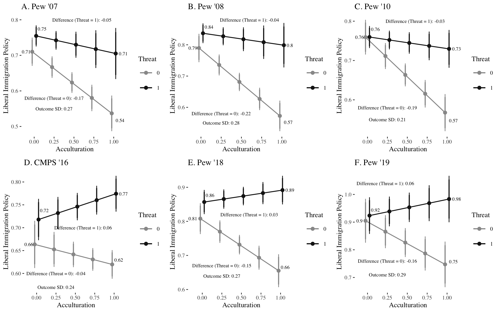
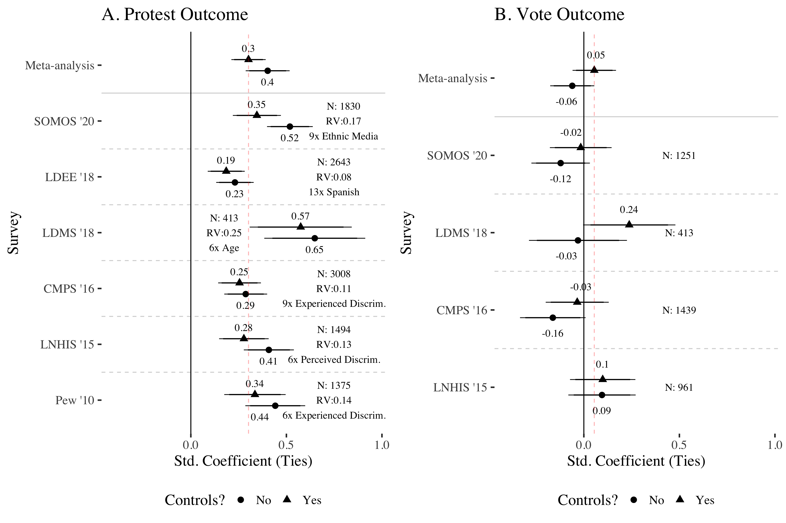
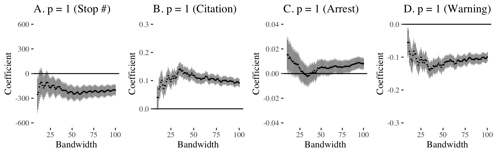
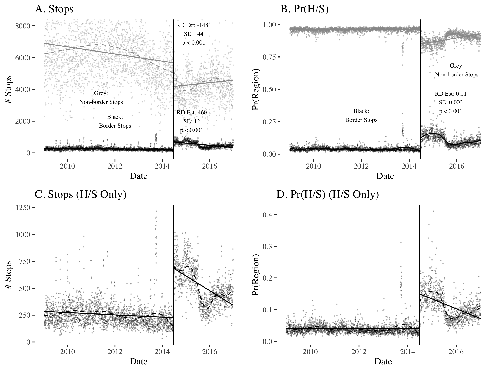
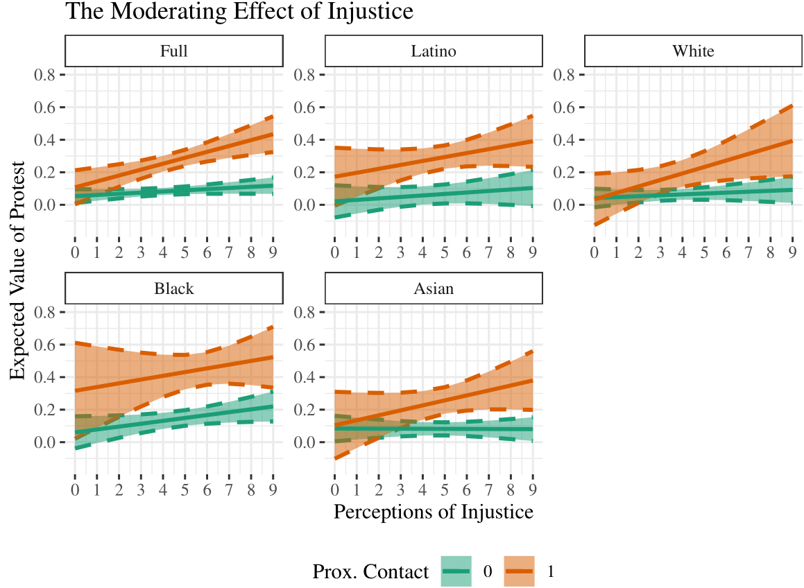

## Working Papers 

**Living in the Shadow of Deportation: How Deportation Threat Forestalls Attitudinal Assimilation Among Immigrants and Their Co-Ethnics (Job Market Paper)** *Under Review* [[PDF]](pdfs/wps/deportation_threat.pdf)

Consistent with straight line assimilation theory, prior research demonstrates acculturation generates attitudinal convergence between immigrant group members and host country natives along several policy dimensions, including immigration. However, other perspectives suggest attitudinal convergence is not guaranteed in contexts where immigrant group members experience rebuff from the host country. I reconcile the perspectives and answer the puzzle of persistent pro-immigrant policy preferences among integrated Latinxs. In light of heightened interior immigration enforcement and the increased societal integration of undocumented immigrants in the U.S., I demonstrate perceptibly threatening immigration enforcement contexts forestall attitudinal convergence on immigration policy preferences across 6 nationally representative surveys of Latinxs. Absent deportation threat, Latinx immigration policy attitudes converge with white Anglos. Deportation threat operates net of well-established alternative mechanisms such as discrimination, ethnic context(s), and ethnic identity. These results problematize preexisting conclusions on the political consequences of threat and suggest attitudinal assimilation is not preordained among immigrant group members.

**How Social Ties with Undocumented Immigrants Motivate Latinx Political Participation (first author, with Hannah Walker and Matt Barreto)** *Conditionally Accepted at Political Research Quarterly* [[PDF]](pdfs/wps/contact_threat.pdf)

Prior research suggests social ties with undocumented immigrants among Latinxs may increase political engagement despite constraints undocumented social networks may introduce. We build on prior research and find across six surveys of Latinxs that social ties with undocumented immigrants are reliably associated with collective, identity expressive activities such as protesting, but not activities where immigration may not be immediately relevant, such as voting. Moreover, we assess a series of mechanisms to resolve the puzzle of heightened participation despite constraints. Consistent with prior research at the intersection of anti-immigrant threat and Social Identity Theory, we find Latinxs with strong ethnic identification are more likely to engage in political protest in the presence of social ties with undocumented immigrants, whereas weak identifiers disengage. We rule out alternative mechanisms that could link undocumented social ties with participation including political efficacy, a sense of injustice, linked fate, acculturation, out-group perceptions of immigration status, partisan identity, conducive opportunity structures, pro-sociality, and liberal ideological motivations irrelevant to immigration. Our contribution suggests the reason social ties with undocumented immigrants are not necessarily a hindrance to political engagement among Latinx immigrants and their co-ethnics is because they can draw from identitarian resources to overcome participatory constraints 

**Less Policing, Less Problems: The Impact of Strategic Depolicing (with Donald Grasse)** [[PDF]](pdfs/wps/depolicing_nash.pdf)

What are the consequences of depolicing? We forward a theory of "strategic depolicing" that posits depolicing may not have deleterious consequences if it reduces unnecessary, ineffective police intrusions. We test the theory by exploiting an exogenous decrease in policing effort after the publication of an expert report finding Metropolitan Nashville Police Department tactics were racially biased and unimportant for public safety. We find police significantly reduced traffic stops, particularly for minor violations (e.g. order maintenance), after the report. Traffic stops became more efficient. Police were more likely to issue citations or make arrests and less likely to give warnings conditional on a stop. We do not find depolicing increased crime or traffic violations, and find some evidence "disorder" crimes decrease (e.g. drug possession, disorderly conduct). The findings suggest expert data analysis can motivate depolicing without the negative consequences typically associated with reductions in policing effort.

**Deputize and Deport: The Effect of Immigration Enforcement on Policing** [[PDF]](pdfs/wps/deputize_deport.pdf)

Does expanding the role of the police to include immigration enforcement reduce their effectiveness? I use a regression discontinuity design and daily data on over 17 million traffic stops to evaluate the effect of a policy directive increasing Texas Department of Public Safety (DPS) Highway Patrol presence near the border in the predominantly Latinx counties of Hidalgo and Starr for the purposes of anti-human and drug trafficking. I find the directive substantially increased the number of traffic stops in its area of operations, increased the rate of unnecessary stops, and decreased the stop-and-search hit rate for recovering relevant contraband (e.g. drugs, weapons). Moreover, the directive appears to have had limited effectiveness in detecting human smuggling, finding undocumented immigrants, and reducing crime. These effects are not driven by an influx of inexperienced troopers, but rather lower thresholds for initializing a traffic stop motivated by the directive, consistent with qualitative accounts of profiling and unwarranted policing in the South Texas region.

## Publications

**The Ripple Effect: The Political Consequences of Proximal Contact with Immgration Enforcement (with Matt Barreto and Hannah Walker)** *Journal of Race Ethnicity and Politics* [[PDF]](pdfs/wps/ripple_effect.pdf)

A growing body of research suggests that proximal exposure to immigration enforcement can have important social and health-related consequences. However, there is little research identifying the impact of proximal contact with immigration policy on political attitudes and behaviors, and still less investigating the underlying mechanisms that might connect contact and political dispositions. Drawing on insights from criminal justice, we argue that proximal immigration contact influences political behavior via a sense of injustice with respect to the discriminatory application of immigration enforcement. The impact of a sense of injustice should primarily hold among Latinos, who are targeted on the basis of race, ethnicity, accent, and skin color. Nevertheless, it may also hold among Blacks, whose communities are targeted more generally, and Asians, to whom issues related to immigration are likewise important. In order to assess this theory, we leverage a survey with nationally representative samples of four different racial groups. We find that proximal contact motivates participation in protests, and does so indirectly via a sense of injustice for white and Asian respondents. Latino and Black respondents are primarily motivated by injustice irrespective of contact. In sum, the results suggest that immigration enforcement and non-immigration-related criminal justice policies may have similar political effects on those who are proximately affected.

**The Direct and Indirect Effects of Immigration Enforcement on Latino Political Engagement (with Matt Barreto and Hannah Walker)** *UCLA Law Review* [[PDF]](pdfs/wps/enforcement_engagement.pdf)

How does having a loved one threatened by detention and deportation impact political
participation? Drawing on extant research demonstrating the mobilizing power of a threatening
immigration environment, we develop a dynamic theory of what scholars elsewhere refer to as
proximal contact. We argue that individuals with proximal connections to punitive immigration
policy may be politically mobilized by the belief that immigration enforcement is unfairly
targeted at Latinos, but a threatening environment also structures this participation. Individuals
are incentivized to withdraw from public institutions, in particular voting, even as they are
incentivized to participate in other arenas. We draw on two cross-sectional surveys, one collected
in 2015 with a robust oversample of noncitizens and another collected in 2018 of Latinos who are
registered voters. We find evidence to support our theory, and in both datasets proximal contact is
unrelated to voting, even as it is positively associated with other types of activities like protesting.
